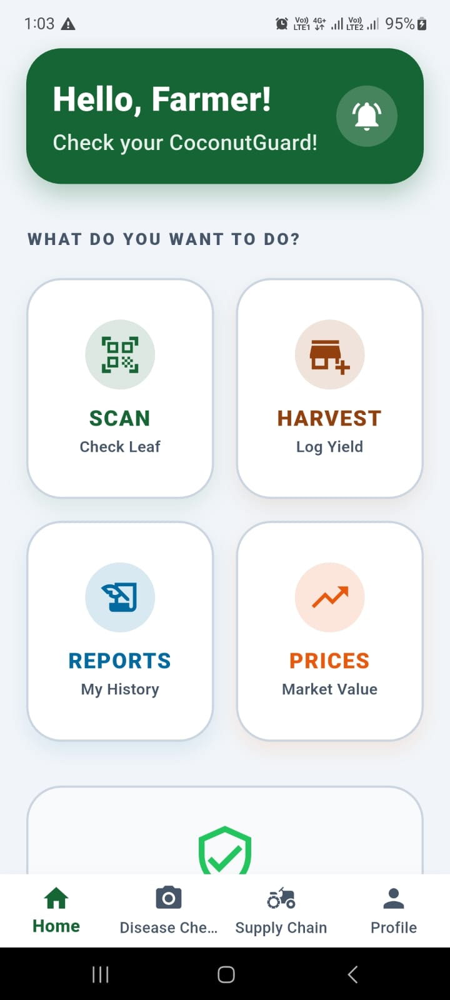
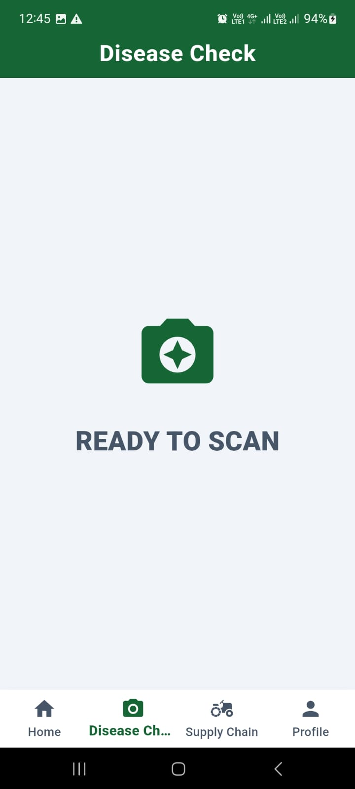
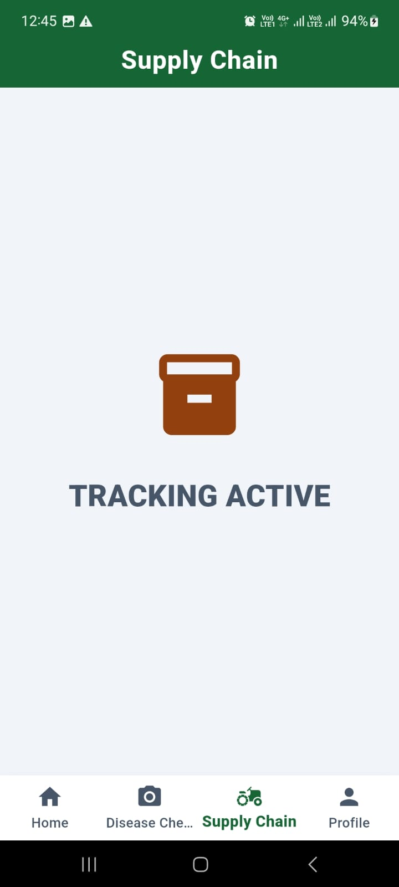
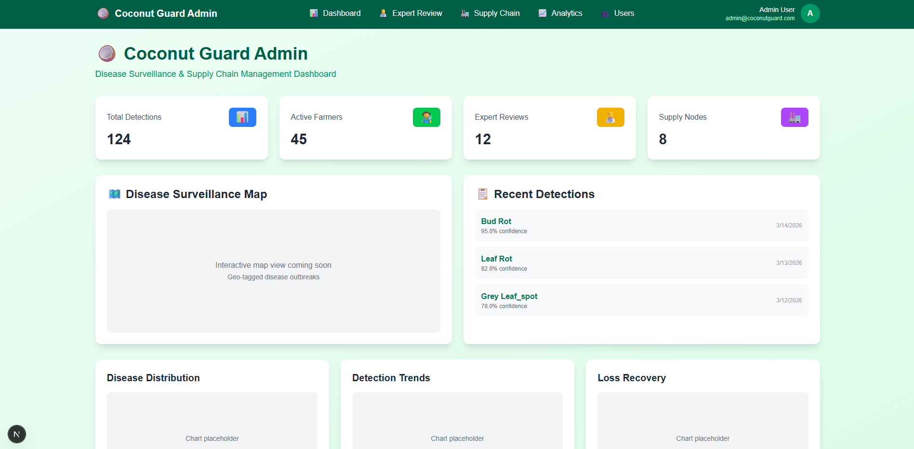
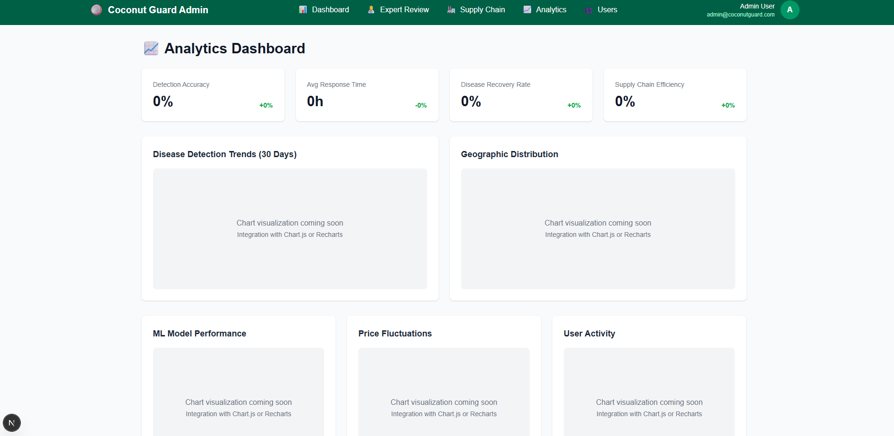
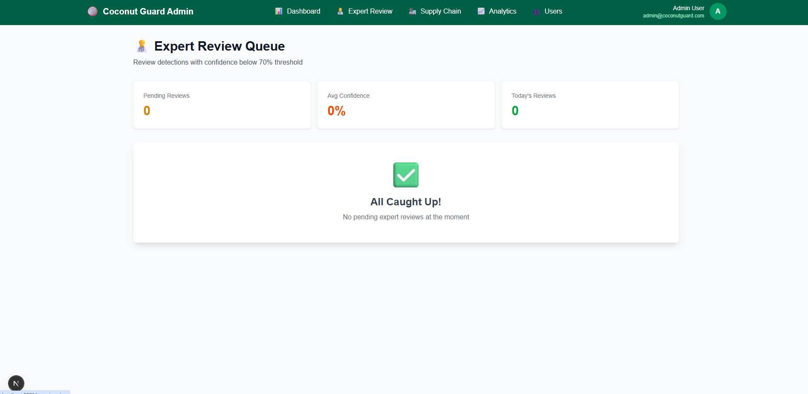
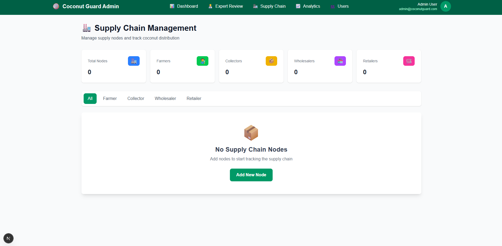

  
  
  
  
  
  
  
  

# 🥥 CoconutGuard

> **AI-Powered Disease Surveillance & Supply Chain Intelligence**

CoconutGuard is a **comprehensive agricultural ecosystem** designed to **protect coconut livelihoods through machine learning and digitized logistics**.

The system focuses on **bridging the gap between field-level diagnosis and centralized expertise** and aims to **provide farmers with real-time, actionable insights while streamlining the harvest supply chain**.

---

# ✨ Key Features

| Feature | Description |
|---|---|
| **AI Disease Guardian** | Edge-based CNN inference for real-time diagnosis of 4 major coconut diseases + healthy state. |
| **Hybrid Supply Chain** | Seamless tracking of yields and log-status from farm gates to regional distributors. |
| **Resilient Sync Engine** | Local-first architecture using Hive & Firestore for zero-data-loss in remote regions. |
| **Expert Review Portal** | Human-in-the-loop verification terminal for agricultural experts to validate ML anomalies. |
| **Farmer Health Analytics** | Personalized dashboards for tracking crop health historical trends and yield predictions. |
| **Secure Edge Persistence** | AES-ready local encryption of demographic and sensitive agricultural data. |

---

# 🎬 Project Demonstration

The following resources demonstrate the system's behavior:

- [📹 Product Video](#-product-video)
- [📸 Screenshots](#-screenshots)
- [🧩 Architecture Overview](#-architecture-overview)
- [🧠 Engineering Lessons](#-engineering-lessons)
- [🔧 Key Design Decisions](#-key-design-decisions)
- [🗺️ Roadmap](#-roadmap)
- [🚀 Future Improvements](#-future-improvements)
- [📄 Documentation](#-documentations)
- [📝 License](#-license)
- [📩 Contact](#-contact)

*If deeper technical access is required, it can be provided upon request.*

---

# 📹 Product Video

> **[DEMONSTRATION PENDING]**

*A comprehensive video or GIF of the system's walkthrough demonstrating the Mobile ML engine and Admin Analytics is available soon!*

---

# 📸 Screenshots

### 📱 Mobile Experience (Farmer)
| Mobile Dashboard | Disease Scan |
|:---:|:---:|
|  |  |

| Supply Chain | Employee Profile |
|:---:|:---:|
|  |  |

### 💼 Admin Dashboard (Expert)

*Centralized management of farm health and system metrics.*

*Detailed trend analysis and disease propagation heatmaps.*

*Specialized interface for human-in-the-loop ML verification.*

*End-to-end logistics and distributor oversight.*

---

# 🧩 Architecture Overview

CoconutGuard is implemented using a **Dual-Platform (Mobile & Web) Micro-Service style, MVVM, modular Architecture** driven by a **Layered Domain Logic** pattern.

### 📱 Mobile Unit (Edge Intelligence)
- **Folder Pattern**: **Layered Architecture (Presentation -> Data -> Services)**.
- **State Management**: **MVVM (Model-View-ViewModel)** to decouple UI from heavy ML/Logic.
- **Data Pattern**: **Repository Pattern** to abstract Hive (Local) and Firestore (Remote) synchronization.
- **Tech Stack**: Flutter & Dart, TFLite (On-device CNN), Hive NoSQL.

### 💼 Central Command (Analytical Web)
- **Folder Pattern**: **Next.js App Router Architecture**.
- **UI Architecture**: **Atomic/Component-Based Design** for high scalability and reusability.
- **Rendering Strategy**: **Server-Side Rendering (SSR)** for fast analytics initialization and SEO.
- **Tech Stack**: Next.js 14, TypeScript, Tailwind CSS, Shadcn/UI.

### ⚙️ Backend & Infrastructure
- **Firebase Ecosystem**: Centralized Firestore DB, Auth, and Storage.
- **Cloud-Edge Bridge**: Custom Background Sync engine for resilient data reconciliation.
- **Security**: RBAC (Role-Based Access Control) enforced at both API and Database levels.

---

# 🧠 Engineering Lessons

During development of CoconutGuard the focus areas included:

- **Edge vs Cloud ML**: Optimizing CNN models for on-device TFLite inference to ensure 100% offline reliability in remote farms.
- **Local-First Synchronization**: Implementing a robust Hive + Firestore background sync engine for a zero-data-loss user experience.
- **Micro-Service Orchestration**: Bridging the gap between the Flutter Edge unit and Next.js Command Center via a shared Cloud Brain (Firebase).
- **Architectural Scalability**: Implementing MVVM and the Repository Pattern to maintain a clean separation of concerns as feature sets grow.
- **Resilient Mocking**: Developing deep service-layer fallbacks that detect initialization failures and pivot to Demo Mode automatically.

> [!IMPORTANT]
> **Read the full [Engineering Lessons](docs/engineering_decisions.md) for a technical deep-dive.**

---

# 🔧 Key Design Decisions

1. **"Coconut-Modern" Aesthetic**
   A specialized palette (#064E3B Deep Emerald & #92400E Harvest Brown) built to mirror healthy foliage and matured harvest for immediate domain trust.

2. **Farmer-First Field UX**
   High-visibility elements and large touch targets designed to be readable under direct sunlight and usable in rugged field conditions.

3. **Atomic UI Hierarchy**
   A structured design system (Atoms -> Molecules -> Organisms) in Next.js ensuring consistency and speed across the Admin Command Center.

4. **Confidence-Based Review Triage**
   A specialized "Human-in-the-loop" threshold system that routes low-confidence ML results to expert review, ensuring a 99%+ system accuracy.

5. **Asynchronous Fluidity**
   Strict enforcement of non-blocking ML operations in the mobile UI to maintain a "zero-lag" feel even during heavy inference processing.

> [!TIP]
> **Read the full [Design Decisions Doc](docs/design_decisions.md) for the UX philosophy breakdown.**

---

# 🗺️ Roadmap

Current development status and upcoming milestones:

- ✅ **Resilient Sync** — Robust offline-first architecture completed.
- 🚧 **Admin Management** — Implementing the admin management system (In Progress).
- 🚧 **Employee Tracking** — Implementing the employee supply chain activity tracking system (In Progress).
- 📅 **AI Disease Core** — High-accuracy CNN model for 4 major diseases. (Planned)

---

# 🚀 Future Improvements

Planned enhancements include:

- **Multilingual Dialect Support**: Voice-guided UI for better inclusivity.
- **streamlined supply chain management**: Integration of real-time market price feeds (In Progress).

---

## 📄 Documentations

| File | Description |
|---|---|
| [**Engineering Decisions**](docs/engineering_decisions.md) | Technical deep-dive into architecture, ML, and sync logic. |
| [**Design Decisions**](docs/design_decisions.md) | UX/UI philosophy and specialized design system. |
| [**System Architecture**](README.md#🧩-architecture-overview) | Core tech stack and communication overview. |

---

# 📝 License

This repository is published for **portfolio and educational review purposes**.

The source code may not be accessed, copied, modified, distributed, or used without explicit permission from the author.

© 2026 Viraj Tharindu — All Rights Reserved.

---

# 📩 Contact

If you are reviewing this project as part of a hiring process or are interested in the technical approach behind it, feel free to reach out.

I would be happy to discuss the architecture, design decisions, or provide a private walkthrough of the project.

📧 **Email**: [**virajtharindu1997@gmail.com**](mailto:virajtharindu1997@gmail.com)  
💼 **LinkedIn**: [**viraj-tharindu**](https://www.linkedin.com/in/viraj-tharindu/)  
🌐 **Portfolio**: [**vjstyles.com**](https://vjstyles.com)  
🐙 **GitHub**: [**VirajTharindu**](https://github.com/VirajTharindu)  

---

  <em>🌴 Built to empower farmers and save 30,000+ tons of coconuts annually through technology. 🌴</em>

